## Environnement et ressources du laboratoire

### VM Serveur Wazuh (wazuhSRV)

- Infrastructure Proxmox : VM210 de Simplon
- OS Ubuntu desktop amd64 22.04.5
- Memory 8GB
- Disk 50 GB

**Identifiants de la machine :**
- Nom de l'ordinateur : `wazuhSRV`
- Nom court : `AGW`
- Adresse IP (réseau interne) : `192.168.1.22`

**Identifiants d'accès :**
- Nom d'utilisateur : `agwz`
- Mot de passe : `tyty123`

**Accès SSH :**
```bash
ssh agwz@***.***.***.*** -p 41876
```

**Tunnel SSH pour accéder à Wazuh Dashboard :**
```bash
ssh -L 8443:127.0.0.1:443 agwz@***.***.***.***  -p 41876
```
Puis accédez via navigateur : `https://127.0.0.1:8443`

**Wazuh Dashboard :**
- URL : `https://192.168.1.22:443`
- Utilisateur : `admin`
- Mot de passe : `R3gq5UkrMEY2mfFqj8II+aOWe*HRZ3Ac`

### VM Client (EndpointClient)

**Identifiants de la machine :**
- Nom de l'ordinateur : `EndpointClient`
- Nom court : `Client`
- Adresse IP (réseau interne) : `192.168.10.67`

**Identifiants d'accès :**
- Nom d'utilisateur : `client`
- Mot de passe : `tyty123`

**Accès SSH :**
```bash
ssh client@***.***.***.***  -p 41877
```

### VM Purple Linux

**Rôle :** Machine d'attaque pour les simulations de sécurité

## Installation
En suivant la documentation : Quickstart (installation de Wazuh) : https://documentation.wazuh.com/current/quickstart.html

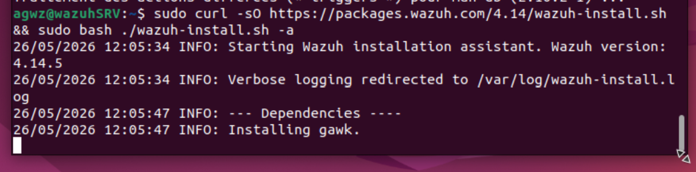

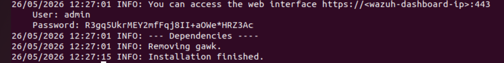

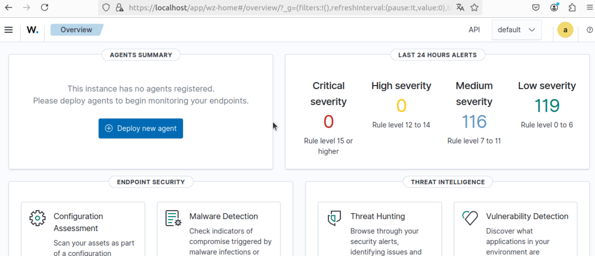

## Deployment d'un agent

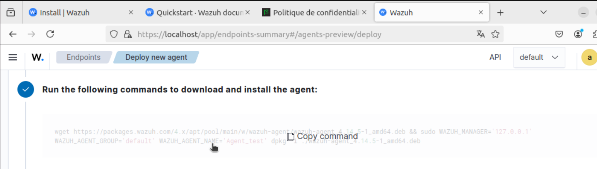

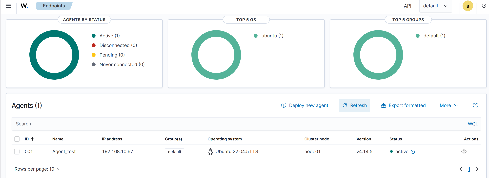

## Intégration de l'IDS Suricata

### **Dans le client** 

- Installation et configuration de Suricata 

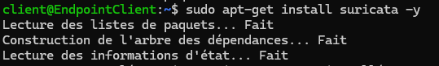

- Test de configurations

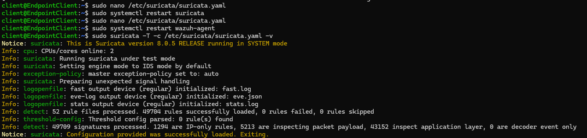

- Test avec un Ping depuis le serveur (Attack emulation)

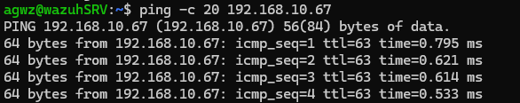

### **Remontée des logs dans Wazuh Dashboard**

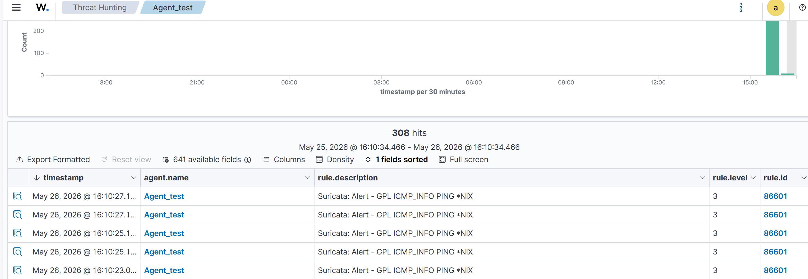

## Surveillance de l'intégrité de répertoires/fichiers sensibles

### **Configuration sur le client**

- Edition du fichier  `/var/ossec/etc/ossec.conf`

- Ajout du bloc suivant pour surveiller le répertoire `/root` :

    `<directories check_all="yes" report_changes="yes" realtime="yes">/root</directories>`
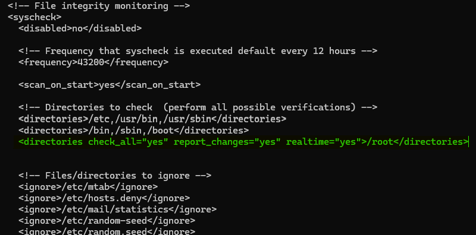

 - Création, modification et suppression d'un fichier dans le répertoire surveillé


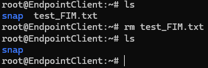

### **Visualisation des alertes dans Wazuh Dashboard**

 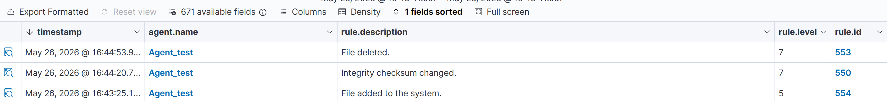

## Détection d'attaque de bruteforce :

### **Simulation depuis une VM Kali Linux**

Exécution de Hydra pour effectuer une attaque par force brute SSH sur la VM Client. Un fichier contenant 10 mots de passe est utilisé.

`sudo hydra -l client -P mdp_list.txt ***.***.***.***  -s 41877 ssh`
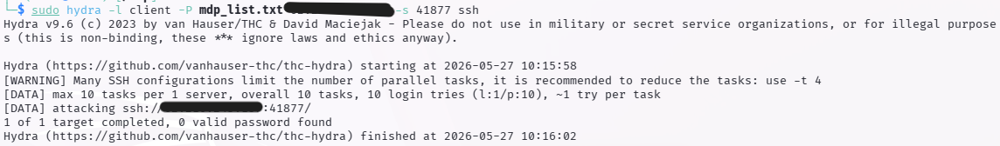

**Visualization des alertes dans Wazuh**

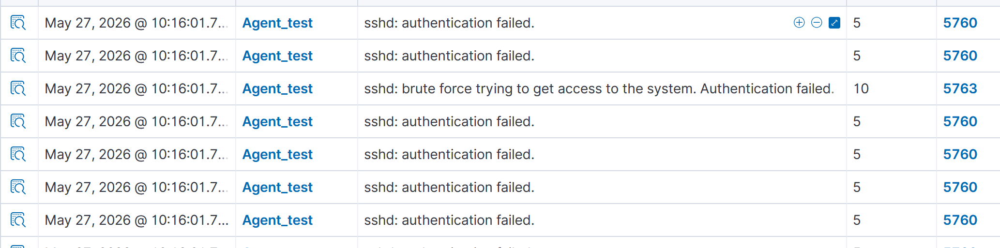

**Exécution de Hydra avec le bon mot de passe dans la liste**

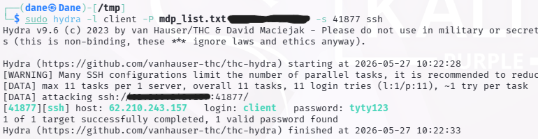

### **Visualization des alertes dans Wazuh**

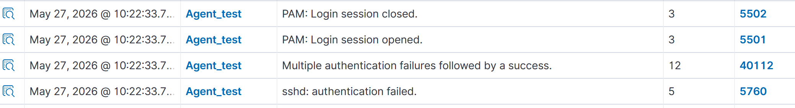

## Détection de processus non autorisés :

### **Dans le client**

Ajout de la configuration pour collecter la liste des processus

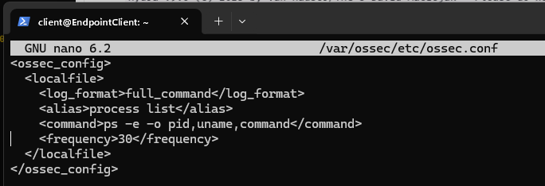

Installation de Netcat :

`client@EndpointClient:~$ sudo apt install ncat nmap -y`

### **Configuration sur le serveur Wazuh**

Ajout de la règle qui nous alerte chaque fois que Netcat est exécuté

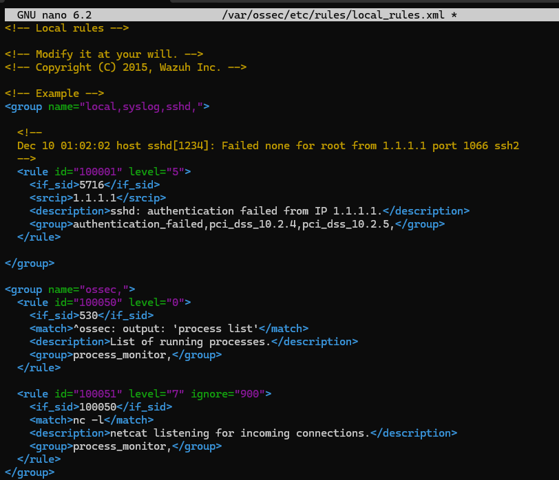

### **Simulation d'attaque depuis le client**

Dans le client : `client@EndpointClient:~$  nc -l 8000`

### **Visualization des alertes dans Wazuh**

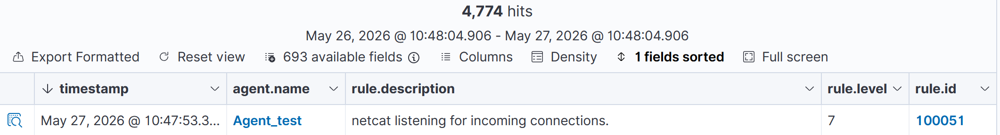

## Détection d'une attaque SQL

### **Dans le client**

Installation d'apache2 : `sudo apt install apache2`

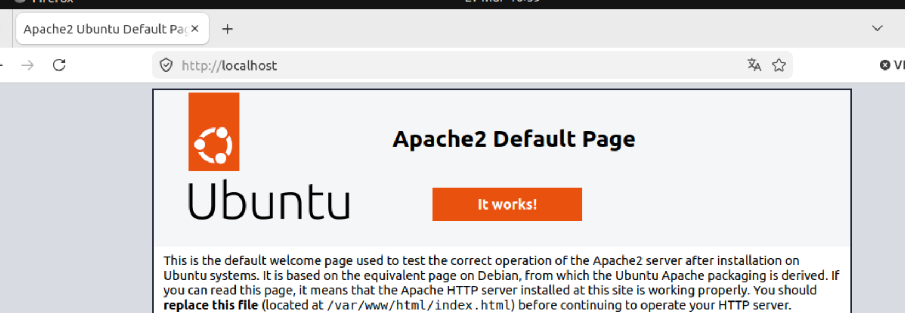

Ajout du bloc suivante dans le fichier ossec.conf pour monitorer les logs d’accès d'Apache.

```
<ossec_config>
  <localfile>
    <log_format>apache</log_format>
    <location>/var/log/apache2/access.log</location>
  </localfile>
</ossec_config>
```

### **Simulation d'attaque**

À partir de la VM Purple Linux :

- Tunnel SSH pour accéder à la VM Client :

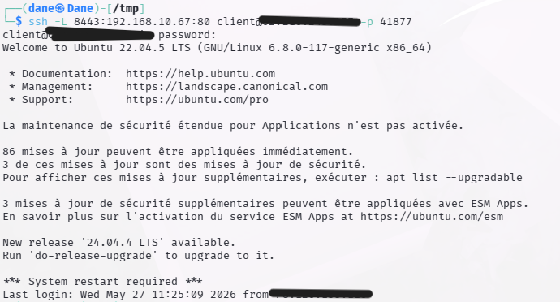

- Exécution de la commande :

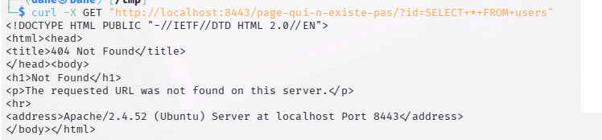

 ### **Visualisation des alertes dans Wazuh Dashboard**

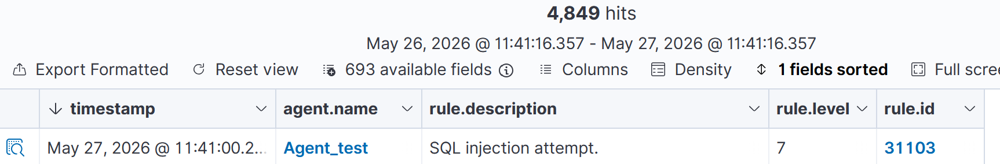

## Détection de cheval de troie :

 ### **Configuration sur le client**


Vérification que la règle dans l'agent est activée :

```
<!-- Policy monitoring -->
  <rootcheck>
    <disabled>no</disabled>
    <check_files>yes</check_files>
    <check_trojans>yes</check_trojans>
    <check_dev>yes</check_dev>
    <check_sys>yes</check_sys>
    <check_pids>yes</check_pids>
    <check_ports>yes</check_ports>
    <check_if>yes</check_if>
  
```

Modification et création d'un script shell pour un fichier binaire :

```
sudo tee /usr/bin/w << EOF
!/bin/bash
echo "`date` this is evil" > /tmp/trojan_created_file
echo 'test for /usr/bin/w trojaned file' >> /tmp/trojan_created_file
Now running original binary
/usr/bin/w.copy
EOF
```

 ### **Visualisation des alertes dans Wazuh Dashboard**

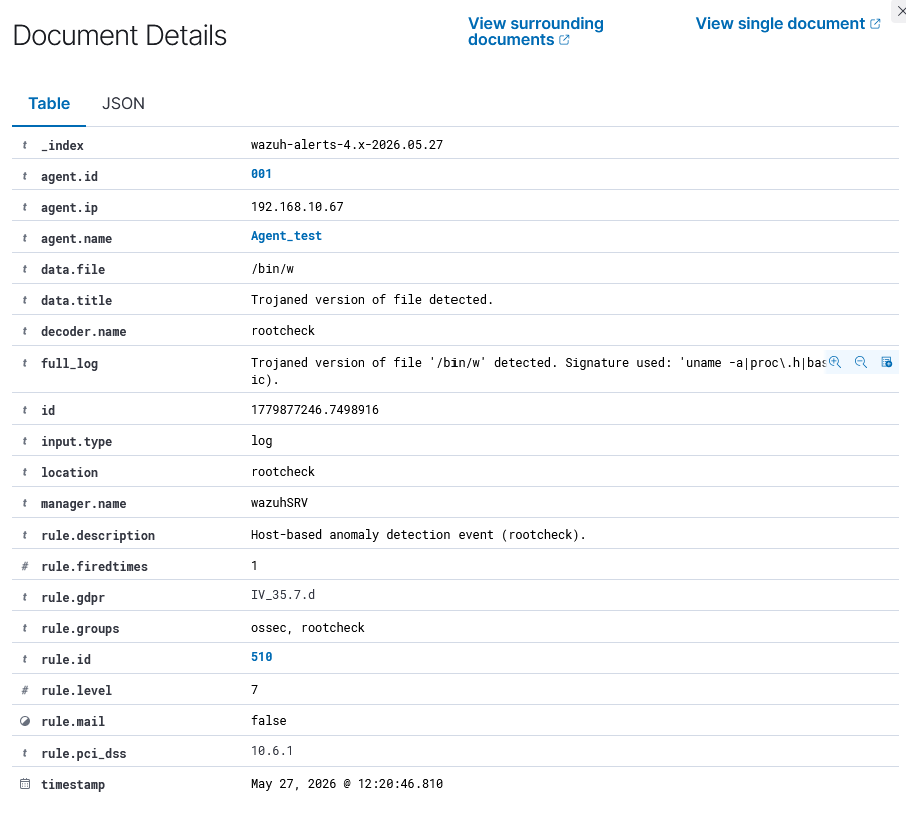

## Traitement de malware à travers l'intégration de VirusTotal

### **Configuration for the Ubuntu endpoint**

- Verification si le repertoire `/root` est  surveillé :
  Dans `/var/ossec/etc/ossec.conf` la ligne `<directories> check_all="yes" report_changes="yes" realtime="yes">/root</directories>` y est.
- Install de 'jq', l'outil pour traiter JSON inputs depuis le script de response active : `sudo apt -y install jq`
- Creation du script pour effacer les fichier malveillantes :

`/var/ossec/active-response/bin/remove-threat.sh`

```
#!/bin/bash

LOCAL=`dirname $0`;
cd $LOCAL
cd ../

PWD=`pwd`

read INPUT_JSON
FILENAME=$(echo $INPUT_JSON | jq -r .parameters.alert.data.virustotal.source.file)
COMMAND=$(echo $INPUT_JSON | jq -r .command)
LOG_FILE="${PWD}/../logs/active-responses.log"

#------------------------ Analyze command -------------------------#
if [ ${COMMAND} = "add" ]
then
 # Send control message to execd
 printf '{"version":1,"origin":{"name":"remove-threat","module":"active-response"},"command":"check_keys", "parameters":{"keys":[]}}\n'

 read RESPONSE
 COMMAND2=$(echo $RESPONSE | jq -r .command)
 if [ ${COMMAND2} != "continue" ]
 then
  echo "`date '+%Y/%m/%d %H:%M:%S'` $0: $INPUT_JSON Remove threat active response aborted" >> ${LOG_FILE}
  exit 0;
 fi
fi

# Removing file
rm -f $FILENAME
if [ $? -eq 0 ]; then
 echo "`date '+%Y/%m/%d %H:%M:%S'` $0: $INPUT_JSON Successfully removed threat" >> ${LOG_FILE}
else
 echo "`date '+%Y/%m/%d %H:%M:%S'` $0: $INPUT_JSON Error removing threat" >> ${LOG_FILE}
fi

exit 0;
```

- Changement de propietaire et des permissions :

```
client@EndpointClient:~$ sudo chmod 750 /var/ossec/active-response/bin/remove-threat.sh
client@EndpointClient:~$ sudo chown root:wazuh /var/ossec/active-response/bin/remove-threat.sh
```

### **Dans Wazuh server**

- Ajout d'une règle dans `/var/ossec/etc/rules/local_rules.xml` pour alerter des changements dans `/root` qui sont détectés par les scans FIM :

```
<group name="syscheck,pci_dss_11.5,nist_800_53_SI.7,">
    <!-- Rules for Linux systems -->
    <rule id="100200" level="7">
        <if_sid>550</if_sid>
        <field name="file">/root</field>
        <description>File modified in /root directory.</description>
    </rule>
    <rule id="100201" level="7">
        <if_sid>554</if_sid>
        <field name="file">/root</field>
        <description>File added to /root directory.</description>
    </rule>
</group>
```

- Ajout de la configuration suivante dans  `/var/ossec/etc/ossec.conf`

  - Pour autoriser l'integration Virustotal, ce qui permets d’exécuter la requête de Virustotal quand les règles 100200 et 100201 sont déclenchés :
    ```
    <ossec_config>
        <integration>
        <name>virustotal</name>
        <api_key><YOUR_VIRUS_TOTAL_API_KEY></api_key> <!-- Replace with your VirusTotal API key -->
        <rule_id>100200,100201</rule_id>
        <alert_format>json</alert_format>
        </integration>
    </ossec_config>
    ```
  - Pour activer "Active Reponse" et executer le script remove-threat.sh quand VirusTotal conciedre un fichier comme malveillant :
    ```
    <ossec_config>
    <command>
        <name>remove-threat</name>
        <executable>remove-threat.sh</executable>
        <timeout_allowed>no</timeout_allowed>
    </command>

    <active-response>
        <disabled>no</disabled>
        <command>remove-threat</command>
        <location>local</location>
        <rules_id>87105</rules_id>
    </active-response>
    </ossec_config>

    ```
- Ajout du bloc suivante dans `/var/ossec/etc/rules/local_rules.xml` pour alerter des résultats de "Active Reponse" :

```
<group name="virustotal,">
  <rule id="100092" level="12">
    <if_sid>657</if_sid>
    <match>Successfully removed threat</match>
    <description>$(parameters.program) removed threat located at $(parameters.alert.data.virustotal.source.file)</description>
  </rule>

  <rule id="100093" level="12">
    <if_sid>657</if_sid>
    <match>Error removing threat</match>
    <description>Error removing threat located at $(parameters.alert.data.virustotal.source.file)</description>
  </rule>
</group>
```

### **Simulation d'attaque**

- **Dans le client**
  Téléchargement d'un fichier de test standardisé pour tester des IDR depuis EICAR.COM

```
client@EndpointClient:~$ sudo curl -Lo /root/eicar.com https://secure.eicar.org/eicar.com && sudo ls -lah /root/eicar.com


  % Total    % Received % Xferd  Average Speed   Time    Time     Time  Current
                                 Dload  Upload   Total   Spent    Left  Speed
100    68  100    68    0     0    206      0 --:--:-- --:--:-- --:--:--   206
-rw-r--r-- 1 root root 68 mai   27 14:39 /root/eicar.com
```

-  ### **Visualisation des alertes dans Wazuh Dashboard**

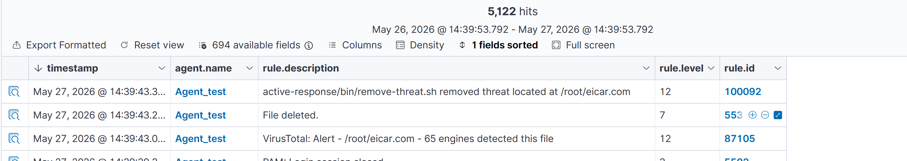

## Vulnerability detection

### **Dans le Serveur Wazuh**

- Verification si la detection de vulnérabilités est activé dans `/var/ossec/etc/ossec.conf` :

```
agwz@wazuhSRV:~$ sudo grep "<vulnerability-detection>" /var/ossec/etc/ossec.conf -A 10 B- 10
  <vulnerability-detection>
    <enabled>yes</enabled>
    <index-status>yes</index-status>
    <feed-update-interval>60m</feed-update-interval>
  </vulnerability-detection>
```

- Verification si la connection de l'indexer est correctement configuré :

```
agwz@wazuhSRV:~$ sudo grep "indexer" /var/ossec/etc/ossec.conf -A 10 B- 10
<indexer>
    <enabled>yes</enabled>
   <hosts>
      <host>https://127.0.0.1:9200</host>
    </hosts>
    <ssl>
      <certificate_authorities>
        <ca>/etc/filebeat/certs/root-ca.pem</ca>
      </certificate_authorities>
      <certificate>/etc/filebeat/certs/wazuh-server.pem</certificate>
      <key>/etc/filebeat/certs/wazuh-server-key.pem</key>
</indexer>
```

 ### **Visualisation des alertes dans Wazuh Dashboard**

Alertes pour le CVE-2025-388 avant et après la désinstallation :

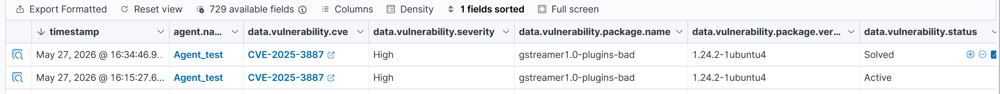

## Détection de processus cachés par rootkit :

### **Configuration client**

- Installation des packages pour construire le rootkit : `apt -y install gcc git`
- Configuration de `ossec.conf` pour réduire la fréquence de 12h à 2 min pour le test.
- Preuve d'installation de rootkit :
  ```
  root@EndpointClient:/home/client/Diamorphine# ls -l diamorphine.ko
  -rw-r--r-- 1 root root 435648 mai   27 16:55 diamorphine.ko
  ```

### **Simulation d'attaque**

Dans ce cas, car la version de linux n'est pas compatible avec le rootkit, au lieu de cacher un processus, on va cacher un dossier.

- Dans le client :

  - Modifier les fichiers `diamorphine.c` et `diamorphine.h` : Remplacer `(6, 9, 0)` par `(6, 8, 0)` dans toutes les lignes.
  - Nettoyer et relancer la compilation  `make clean && make`
  - Executer le rootkit : `insmod diamorphine.ko`
  - Créer un répertoire avec le mot cle `diamorphine_secret` : `mkdir /tmp/diamorphine_secret_test`
  - Le repertoire est invisible : `ls -la /tmp/ | grep diamorphine` ne retourne rien
- Visualization des alertes dans Wazuh :

  - 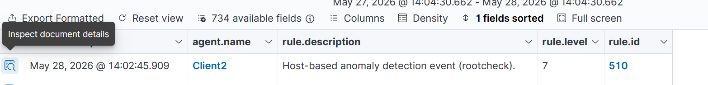
  - 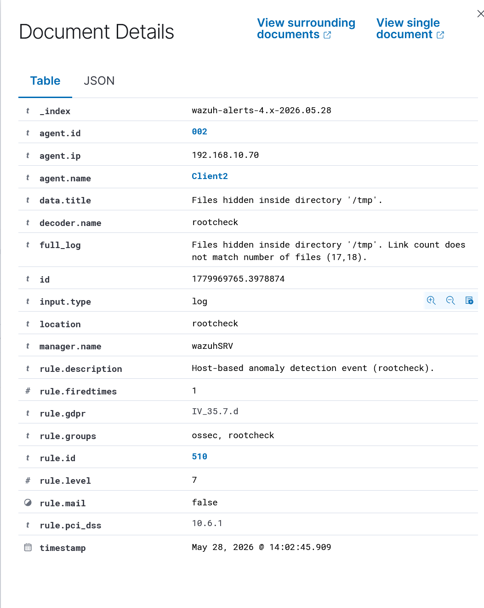

## Détection de commandes malveillantes :

### **Configuration client**

- Installation de "Auditd" et creations des règles d'audit pour interroger les commandes executes par un utilisateur avec privileges :

  ```
  sudo apt -y install auditd
  sudo systemctl start auditd
  sudo systemctl enable auditd

  Ajouts des règles : 

  echo "-a exit,always -F auid=1000 -F egid!=994 -F auid!=-1 -F arch=b32 -S execve -k audit-wazuh-c" >> /etc/audit/audit.rules
  echo "-a exit,always -F auid=1000 -F egid!=994 -F auid!=-1 -F arch=b64 -S execve -k audit-wazuh-c" >> /etc/audit/audit.rules

  Recharger les règles et confirmation :

  sudo auditctl -R /etc/audit/audit.rules
  sudo auditctl -l

  ```

  Confirmation :

  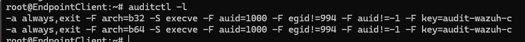
- Configuration de l'agent Wazuh :

  - ```
    <localfile>
        <log_format>audit</log_format>
        <location>/var/log/audit/audit.log</location>
    </localfile>


    sudo systemctl restart wazuh-agent
    ```

### **Dans Wazuh server**

- Creation d'une liste CDB : "var/ossec/etc/lists/suspicious-programs" avec les differents logiciels "suspicieux"
  ```
  ncat:yellow
  nc:red
  tcpdump:orange
  ```

-Ajout de la liste dans le fichier conf du serveur, dans la section `<ruleset>` :

    `<list>`etc/lists/suspicious-programs`</list>`

- Creation d'une règle avec un tag de severité haute , dans `/var/ossec/etc/rules/local_rules.xml ` :
  ```
   <group name="audit">
   <rule id="100210" level="12">
       <if_sid>80792</if_sid>
   <list field="audit.command" lookup="match_key_value" check_value="red">etc/lists/suspicious-programs</list>
       <description>Audit: Highly Suspicious Command executed: $(audit.exe)</description>
       <group>audit_command,</group>
   </rule>
   </group>
  ```

### **Simulation de l'attaque**

- Dans le client :

  ```
  sudo apt -y install netcat
  c -v
  ```
- Visualization des alertes dans Wazuh dans `data.audit.command:nc`

  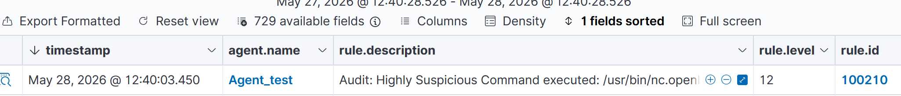

## Détection d'attaques shellshock :

### **Configuration client**

- Installation apache (déjà fait ulterieurement)

  ```
  sudo apt update
  sudo apt install apache2
  ```
- Ajout des lignes suivantes pour que l'agent aille acces aux logs d'apache

  - ```
    <localfile>
        <log_format>syslog</log_format>
        <location>/var/log/apache2/access.log</location>
    </localfile>
    ```

    et `systemctl restart wazuh-agent`

### **Simulation de l'attaque**

- À partir de la VM Purple Linux :

  - Tunnel ssh :

    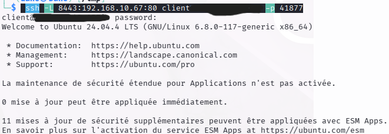
  - Commande : `sudo curl -H "User-Agent: () { :; }; /bin/cat /etc/passwd" 192.168.10.67`

    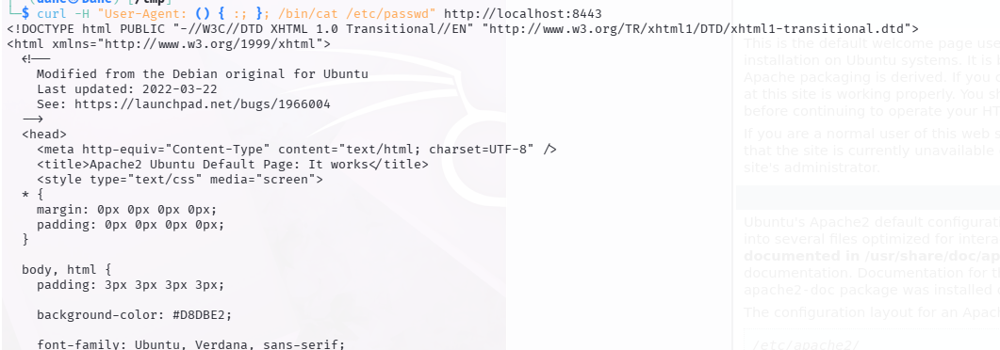
- Visualization des alertes dans Wazuh :

  - rule.description:Shellshock attack detected :

    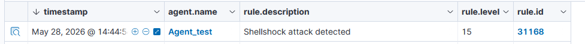

    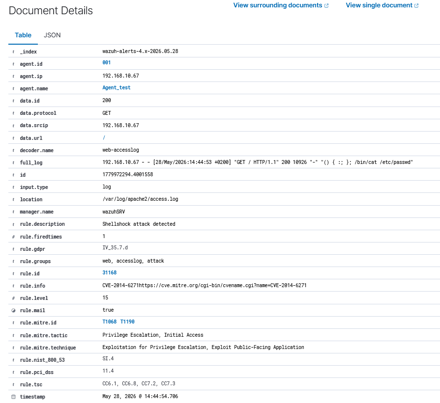
